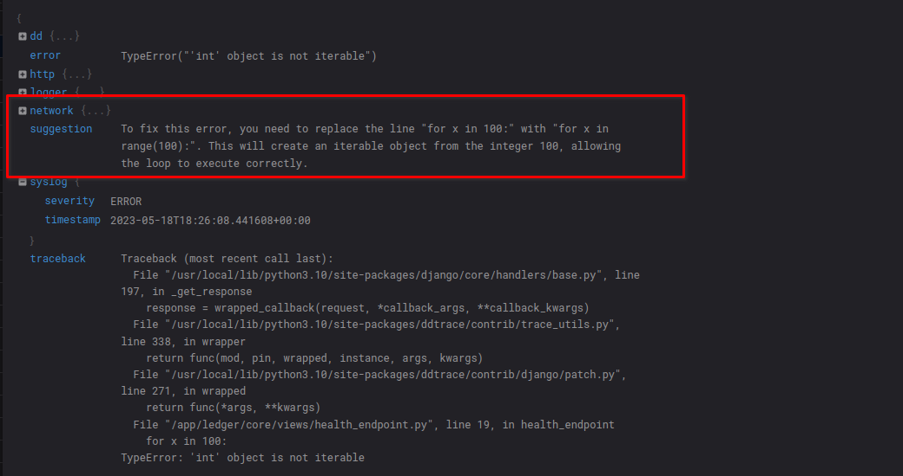

# Code Sage
#### A django middleware package that provides suggestions for unhandled errors/exceptions by using OpenAI.

Currently, the suggestions are added to the [python loggers extra fields](https://docs.python.org/3/library/logging.html#:~:text=The%20third%20optional%20keyword%20argument%20is%20extra,be%20incorporated%20into%20logged%20messages.%20For%20example%3A).

## Features

* Provide suggestions to resolve unhandled errors using OpenAI
* Locally cached code sage suggestions
* Easily enable or disable code sage per environment 
* Customize code sage's suggestion response word length


## Requirements
An API key from OpenAPI, [which can be found here](https://platform.openai.com/account/api-keys).

## Quickstart
1. Install `code-sage` with a package manager, eg.:
    * `pip install code-sage`
    * `poetry add code-sage`
    * `pipenv install pipenv`
2. Add the following to either django settings or environment variables:
```python
OPEN_AI_API_KEY = "your-api-key"
CODE_SAGE_ENABLED = True
```
3. Update the django middleware to include `code-sage`
```python
MIDDLEWARE = [
    # ...
    "code-sage.middleware.ErrorHandlerMiddleware",
    # ...
]
```

## Example
This was tested with the code
```python
for x in 100:
    print(x)
```
which gave the suggestion 
> To fix this error, you need to replace the line "for x in 100:" with "for x in range(100):". 
> This will create an iterable object from the integer 100, allowing the loop to execute correctly.
 
Testing showed that it can also reference variables names when suggesting a solution. This is thanks to the 
`traceback.format_exc()` that is provided to OpenAI when requesting a solution.

This also plays well with things like datadog, thanks to using the `extra` field in pythons logging.


## Configuration
A few things can be done to configure code sage. These can be set in either environment variables or 
through django settings files.

| Setting                         | Type    | Default |
|---------------------------------|---------|---------|
| OPEN_AI_API_KEY                 | string  | (None)  |
| CODE_SAGE_ENABLED               | Boolean | False   |
| CODE_SAGE_SUGGESTION_WORD_LIMIT | Integer | 120     |

